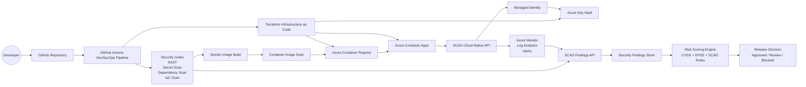

# SCAD Architecture

SCAD means **Secure Cloud-Native Application Delivery**.

## High-level diagram

## Detailed flow

1. A developer pushes code to GitHub.
2. GitHub Actions starts the SCAD DevSecOps pipeline.
3. The pipeline installs dependencies, runs linting, runs tests, and audits dependencies.
4. Gitleaks scans the repository for accidental secrets.
5. Terraform is formatted, initialized, validated, and scanned with Checkov.
6. The pipeline builds a Docker image for the API.
7. Trivy scans the image for high and critical vulnerabilities.
8. For manual deployments, Terraform provisions Azure infrastructure.
9. The image is pushed to Azure Container Registry.
10. Azure Container Apps pulls and runs the image using managed identity.
11. Each request receives or propagates a trace ID for log and response correlation.
12. The app exposes health, readiness, deployment metadata, trace, and Prometheus metrics endpoints.
13. Logs and metrics are sent to Azure Monitor and Log Analytics.
14. Security scan results can be sent to the SCAD Findings API.
15. SCAD normalizes findings from different tools into one common format.
16. The Risk Scoring Engine combines severity, CVSS, EPSS, and SCAD policy rules.
17. SCAD returns a release decision: approved, needs review, or blocked.

## Main architecture decisions

- **One repository** keeps the app, pipeline, and infrastructure easy to present.
- **Azure Container Apps** provides a professional cloud-native runtime without the operational overhead of AKS.
- **Terraform** demonstrates infrastructure as code and repeatable deployments.
- **Managed Identity** avoids hardcoded cloud credentials in application code.
- **Key Vault** centralizes secrets for future app integrations.
- **Security gates** stop vulnerable code, leaked secrets, insecure IaC, or vulnerable images before deployment.
- **Security data integration** converts scan outputs from multiple tools into normalized findings.
- **Risk scoring** turns technical findings into a clear release decision for security governance.
- **Request tracing** propagates `X-Request-Id`, `X-Correlation-Id`, and W3C trace context so API responses, logs, and monitoring events can be correlated during debugging or incident response.

## Production hardening roadmap

For a real enterprise deployment, the next controls to add are:

- Private endpoints for Key Vault and Azure Container Registry
- Disabled public network access for sensitive services
- Premium ACR with zone redundancy and geo-replication
- Defender for Cloud registry vulnerability assessment
- Network-isolated Container Apps environment
- Centralized alert routing to an incident response channel

The first SCAD version keeps the cloud footprint smaller so it is easier to deploy, demo, and explain as a portfolio project.
