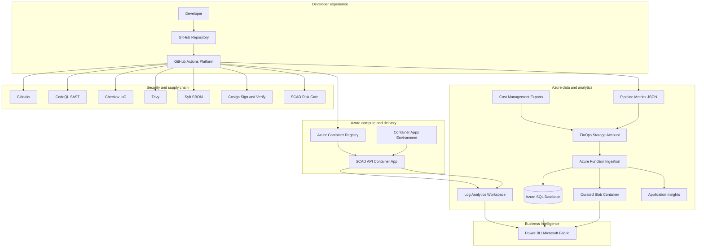

# Azure architecture for SCAD

SCAD deploys a DevSecOps delivery platform with FinOps analytics, observability, and Power BI-ready data paths on Azure.

## High-level architecture



## Resource groups and responsibilities

| Layer | Azure resources | Purpose |
|-------|-----------------|---------|
| Delivery | ACR, Container Apps, Managed Identity | Run SCAD API |
| Security | Key Vault, RBAC assignments | Secrets and least privilege |
| Observability | Log Analytics, Application Insights | Runtime and ingestion telemetry |
| FinOps | Storage Account, Cost exports, Function, SQL | Cost and pipeline analytics |
| CI/CD integration | GitHub Actions OIDC | Build, scan, deploy, publish metrics |

## Data flows

### 1. Application runtime logs

```text
SCAD API -> stdout / platform logs -> Log Analytics -> Power BI
```

### 2. Cost and usage exports

```text
Azure Cost Management
  -> Daily ActualCost CSV
  -> Daily Usage CSV
  -> Daily FOCUS Parquet (when supported)
  -> Blob: focus-cost/
  -> Event Grid
  -> Azure Function
  -> Azure SQL cost_files + curated summaries
  -> Power BI
```

### 3. CI/CD pipeline metrics

```text
GitHub Actions workflow
  -> pipeline-findings.json + run metadata
  -> Blob: pipeline-metrics/
  -> Event Grid
  -> Azure Function
  -> Azure SQL pipeline_runs
  -> Power BI
```

### 4. Security and release governance

```text
Scans in GitHub Actions
  -> SARIF in Security tab
  -> pipeline findings artifact
  -> SCAD risk gate
  -> deploy blocked or approved
```

## Environments

| Environment | GitHub environment | Terraform `environment` | Purpose |
|-------------|-------------------|-------------------------|---------|
| CI | n/a | n/a | Validate on pull requests |
| Staging | `staging` | `staging` | Auto deploy from `main` |
| Production | `production` | `production` | Manual promotion or release tag |

## Identity and access

| Identity | Access |
|----------|--------|
| Container App managed identity | AcrPull, Key Vault Secrets User |
| Function managed identity | Storage Blob Reader/Contributor, Key Vault Secrets User |
| GitHub Actions OIDC principal | Deploy, optional Storage Blob Contributor for metrics |

## Terraform layout

```text
infrastructure/terraform/
├── main.tf                 # SCAD app platform
├── finops.tf               # FinOps module invocation
├── modules/finops/         # Storage, exports, SQL, Function, Event Grid
└── outputs.tf              # URLs, storage, SQL, Log Analytics
```

## Power BI connection points

| Source | Table / file | Dashboard examples |
|--------|--------------|--------------------|
| Azure SQL | `pipeline_runs` | Pipeline success rate, risk decisions |
| Azure SQL | `cost_files` | Export ingestion health |
| Blob `curated/` | `*.summary.json` | Lightweight JSON models |
| Log Analytics | `ContainerAppConsoleLogs_CL` | App errors and latency |
| Cost exports | `focus-cost/` raw files | Deep cost allocation modeling |

See [`finops-power-bi.md`](finops-power-bi.md) for connection steps.

## Production hardening checklist

- [ ] Move Terraform state to Azure Storage backend
- [ ] Set `ci_principal_id` for GitHub OIDC metrics upload
- [ ] Set repository variable `SCAD_FINOPS_STORAGE_ACCOUNT`
- [ ] Enable `SCAD_REQUIRE_API_AUTH=true` on the API
- [ ] Store ingest/auth secrets in Key Vault
- [ ] Add approval rules on `production` environment
- [ ] Disable `enable_focus_export` if subscription does not support FOCUS
