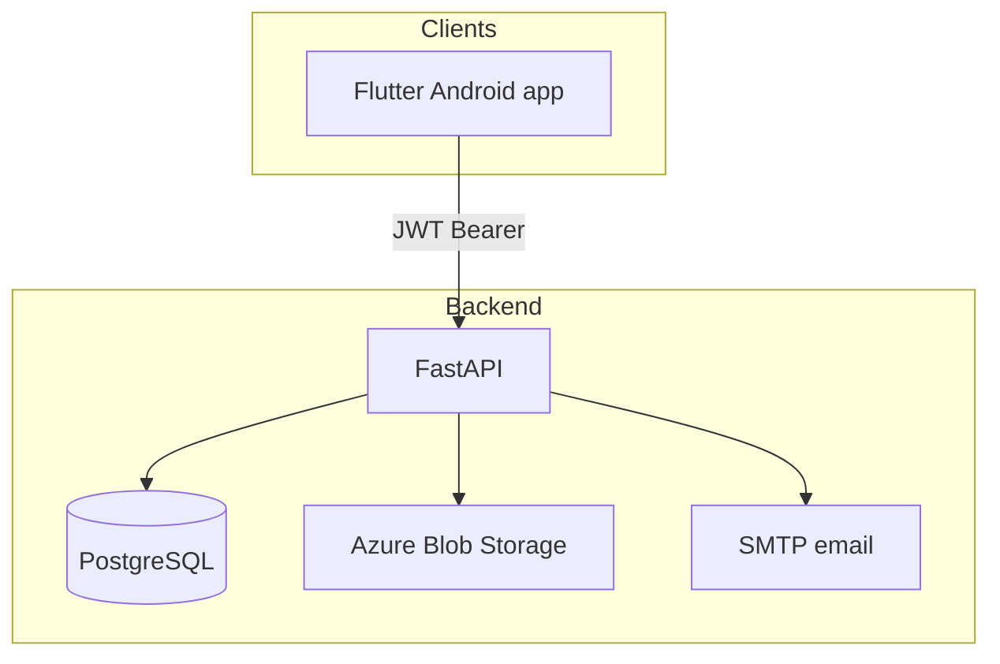
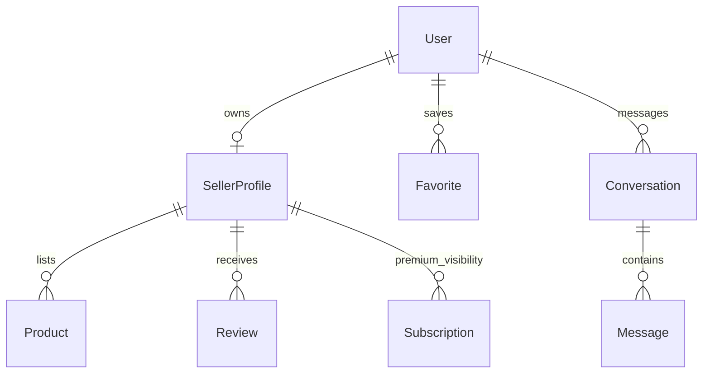

# MarGem — Architecture

MarGem is a **third-party local discovery / connection platform**. Buyers find nearby businesses, compare listings, and contact sellers. Transactions and payments happen **outside** the app. There is no cart, checkout, payment processing, shipping, or in-app refunds.

## System overview

## Auth model

- Primary: email/password with MarGem JWT access + refresh tokens
- Optional: Firebase ID tokens when `FIREBASE_*` is configured
- Roles: `buyer` / `seller` account types; `admin` / `support` staff roles
- Guests may browse; favorites migrate on signup

## Core domain

## API surface (selected)

| Area | Paths |
|------|--------|
| Health | `/live`, `/ready`, `/health` |
| Auth | `/auth/register`, `/auth/login`, `/auth/refresh`, `/auth/me` |
| Discovery | `/sellers`, `/sellers/map`, `/categories`, `/favorites/*`, `/follows`, `/contact-events` |
| Messaging | `/messages/conversations`, `/messages/sellers/{id}`, `/messages/users/{id}` |
| Seller ops | `/seller/analytics`, `/notifications`, premium plans |
| Admin | `/admin/users`, `/admin/sellers/pending`, verify/status (admin-only writes) |
| Uploads | `/uploads` → Azure Blob (durable public URLs) |

## Security highlights

- Production rejects default JWT secrets and `DEBUG=true`
- ProxyHeaders scoped to `ALLOWED_HOSTS`
- Request body size hard-capped (including chunked)
- Media/social URL allowlisting; featured listings gated on premium
- Rate limits on auth, uploads, messaging, and admin mutations
- Staff (`SUPPORT`) can list pending sellers/users; only `ADMIN` may verify or suspend

## Deployment

1. **PostgreSQL** — primary datastore (Alembic migrations)
2. **API container** — FastAPI + non-root user + `/ready` healthcheck
3. **Azure Blob** — listing media
4. **Compose** — `docker-compose.yml` (dev), `.home.yml` (LAN), `.budget.yml` (single VM)
5. **CI** — root workflow `.github/workflows/margem-ci.yml`

## Explicit non-goals

Cart, checkout, Stripe/PayPal, card storage, payment intermediary, shipping, warehouse, in-app refunds.
