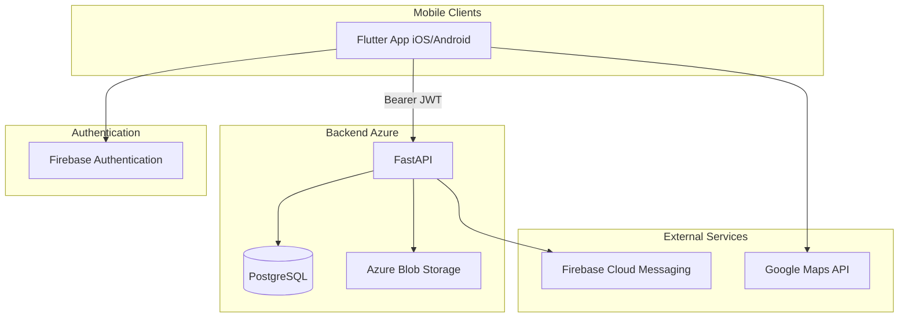
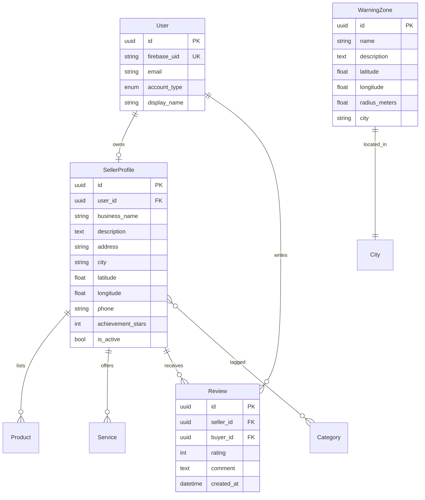

# Souq Local — Architecture

## System overview



## Data model (MVP)



## Achievement star logic

Achievement stars are derived from **five-star reviews only**:

```python
achievement_stars = five_star_review_count // 100
```

Recomputed on each new review and stored on `SellerProfile.achievement_stars` for fast map/profile display.

## API surface (MVP)

| Method | Path | Description |
|--------|------|-------------|
| GET | `/health` | Health check |
| POST | `/auth/register` | Register user metadata after Firebase signup |
| GET | `/auth/me` | Current user profile |
| GET | `/categories` | List business categories |
| GET | `/sellers` | List/search sellers (city, category, q) |
| POST | `/sellers` | Create seller profile (seller accounts) |
| GET | `/sellers/{id}` | Seller detail + products + services |
| PATCH | `/sellers/{id}` | Update seller profile |
| GET | `/sellers/map` | GeoJSON-style pins for map view |
| POST | `/sellers/{id}/reviews` | Submit review (buyers) |
| GET | `/sellers/{id}/reviews` | List reviews |
| GET | `/warning-zones` | Scam-prone area markers by city |
| POST | `/uploads/presign` | Presigned URL for Azure Blob upload |

## Security

- Firebase ID tokens verified on protected routes
- Sellers can only mutate their own profile
- Buyers can only submit one review per seller (update allowed)
- Rate limiting and input validation on public endpoints (production)

## Deployment (Azure)

1. **Azure Database for PostgreSQL** — primary datastore
2. **Azure Container Apps** — FastAPI container
3. **Azure Blob Storage** — product/service images
4. **Azure Key Vault** — secrets (DB, Firebase, Maps keys)
5. **Firebase** — auth + push (mobile SDK)

## Future phases

- In-app messaging, favorites, reservations, click & collect
- Premium seller tiers (featured listings, analytics)
- Admin dashboard, business verification, multi-language (AR/FR/EN)
- AI-powered search
