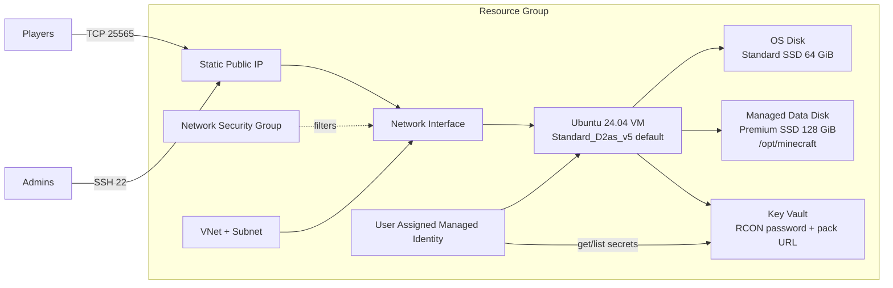

# Superior RPG Minecraft on Azure without AMP

Production-ready Terraform for a public Superior RPG Minecraft server on Microsoft Azure using Ubuntu 24.04 LTS, Java 21, and a direct `systemd` service. CubeCoders AMP is intentionally not used, which removes the AMP license requirement, lowers runtime overhead, and reduces the public attack surface.

## Architecture



## What Terraform creates

- Resource group
- Virtual network and subnet
- Network security group
- Static Standard public IP
- Network interface
- Ubuntu Server 24.04 LTS VM
- OS managed disk
- Dedicated managed data disk
- Boot diagnostics using Azure managed storage
- User-assigned managed identity
- Key Vault for bootstrap secrets
- VM-scoped role assignment for self-deallocation when idle shutdown is enabled

No AMP panel, no AMP license key, no panel ports, no load balancer, and no Azure Monitor workspace are created by default.

## Required variables

Create `terraform.tfvars`:

```bash
cd terraform
cp terraform.tfvars.example terraform.tfvars
```

Minimum required values:

```hcl
ssh_public_key = "ssh-ed25519 YOUR_PUBLIC_KEY"
superior_rpg_server_pack_url = "https://example.com/superior-rpg-server-pack.zip"
```

Strongly recommended:

```hcl
admin_ssh_source_cidrs = ["YOUR_PUBLIC_IP/32"]
```

The default Azure region is Sweden Central:

```hcl
location = "swedencentral"
```

## VM sizing decision

Default: `Standard_D2as_v5`.

Why:

- Stable non-burst CPU, unlike B-series.
- 2 vCPU and 8 GiB RAM are suitable for one modded Superior RPG server with up to 8 players.
- 6 GiB heap leaves memory for Ubuntu, filesystem cache, backups, and monitoring.
- Better memory-per-dollar for modded Minecraft than small F-series sizes.

Scale path:

```hcl
vm_size               = "Standard_D4as_v5"
minecraft_memory_mb   = 10240
minecraft_max_players = 20
```

This keeps the same IP, disk, VNet, and security model.

## Storage decision

Default data disk: 128 GiB `Premium_LRS`.

- Standard HDD is too slow for chunk IO.
- Standard SSD is cheaper but less predictable for modded chunk loading.
- Premium SSD gives the best performance-per-dollar for this workload.
- Premium SSD v2 is not necessary for an 8-20 player server and adds tuning complexity.

Minecraft lives at:

```text
/opt/minecraft/server
```

Backups live at:

```text
/opt/minecraft/backups
```

## Network rules

| Port | Source | Purpose |
| --- | --- | --- |
| TCP 22 | `admin_ssh_source_cidrs` | SSH administration |
| TCP 25565 | `minecraft_source_cidrs` | Public Minecraft gameplay |
| TCP 80/443 | disabled by default | Optional reverse proxy/status page |

RCON listens locally on `127.0.0.1:25575` and is not exposed through Azure NSG or UFW.

## Linux bootstrap

Cloud-init runs:

```text
/usr/local/sbin/bootstrap-minecraft.sh
```

Logs:

```text
/var/log/minecraft-bootstrap.log
```

The script:

- Installs Java 21 and OS dependencies
- Creates a dedicated `minecraft` system user
- Mounts the managed data disk at `/opt/minecraft`
- Downloads and extracts the Superior RPG server pack
- Accepts the EULA
- Configures `server.properties`
- Writes optimized JVM flags
- Installs `minecraft.service`
- Configures UFW, fail2ban, SSH hardening, unattended security updates, sysctl tuning, file limits, and Transparent Huge Pages disablement
- Installs backup, health, and idle-shutdown timers

## Operating the server

Check service status:

```bash
sudo systemctl status minecraft.service
```

Start/stop/restart:

```bash
sudo systemctl start minecraft.service
sudo systemctl stop minecraft.service
sudo systemctl restart minecraft.service
```

Follow logs:

```bash
sudo journalctl -u minecraft.service -f
```

Connect from Minecraft:

```bash
terraform output minecraft_server_address
```

## Backups

Daily compressed backups are handled by:

- `minecraft-backup.service`
- `minecraft-backup.timer`

Backup archive format:

```text
/opt/minecraft/backups/superior-rpg-YYYYMMDD-HHMMSS.tar.zst
```

Retention defaults to 14 days:

```hcl
backup_retention_days = 14
```

Run a backup manually:

```bash
sudo systemctl start minecraft-backup.service
```

## Monitoring

Lightweight local monitoring is handled by:

- `minecraft-health.service`
- `minecraft-health.timer`

Log:

```text
/opt/minecraft/logs/health.log
```

It records CPU, RAM, disk usage, service state, Java process IDs, and TPS output when RCON is ready.

## Idle shutdown budget control

Enabled by default:

```hcl
enable_idle_shutdown        = true
idle_shutdown_grace_minutes = 5
```

Behavior:

1. Timer starts checking after boot.
2. It queries local RCON with `list`.
3. If players are online, it does nothing.
4. If zero players are online, it waits 5 minutes.
5. It checks again.
6. If still empty, it stops Minecraft, runs a final backup, and deallocates the Azure VM.

Files:

```text
/usr/local/sbin/minecraft-idle-shutdown.sh
/opt/minecraft/logs/idle-shutdown.log
```

Important: when the VM is deallocated, the server cannot auto-start for players. Start it from Azure Portal or Azure CLI:

```bash
az vm start \
  --resource-group "$(terraform output -raw resource_group_name)" \
  --name "$(terraform output -raw virtual_machine_name)"
```

Disable idle shutdown if the server must stay online:

```hcl
enable_idle_shutdown = false
```

## Estimated monthly cost

Approximate pay-as-you-go monthly cost at 730 hours:

| Component | Default | Estimate |
| --- | --- | --- |
| VM compute | `Standard_D2as_v5` Linux | about USD 70-90/month |
| OS disk | 64 GiB Standard SSD | about USD 3-5/month |
| Data disk | 128 GiB Premium SSD | about USD 18-22/month |
| Static public IP | Standard IPv4 | about USD 3-5/month |
| Key Vault | Standard, low transactions | usually under USD 1/month |

Idle shutdown can significantly reduce VM compute cost if the server is not used 24/7. Disks, public IP, and Key Vault continue to incur small charges while the VM is deallocated.

## Deploy

```bash
cd terraform
terraform init
terraform plan -out tfplan
terraform apply tfplan
```

Useful outputs:

```bash
terraform output ssh_command
terraform output minecraft_server_address
terraform output virtual_machine_name
```

## Destroy

```bash
cd terraform
terraform destroy
```

Before destroying, copy backups if you need to keep the world:

```bash
scp azureadmin@$(terraform output -raw public_ip_address):/opt/minecraft/backups/*.tar.zst .
```

## Troubleshooting

Bootstrap:

```bash
sudo tail -n 200 /var/log/minecraft-bootstrap.log
sudo cloud-init status --long
```

Minecraft service:

```bash
sudo systemctl status minecraft.service
sudo journalctl -u minecraft.service -n 200
```

Firewall:

```bash
sudo ufw status verbose
sudo ss -lntp | grep 25565
```

Backups:

```bash
systemctl status minecraft-backup.timer
tail -n 100 /opt/minecraft/logs/backup.log
```

Idle shutdown:

```bash
systemctl status minecraft-idle-shutdown.timer
tail -n 100 /opt/minecraft/logs/idle-shutdown.log
```

Low TPS:

- Pregenerate chunks.
- Reduce `view-distance` from 8 to 6.
- Reduce `simulation-distance` from 6 to 4.
- Resize to `Standard_D4as_v5` before raising heap too far.
- Keep backups scheduled during low-player hours.

## Upgrade server pack

1. Run a backup:

   ```bash
   sudo systemctl start minecraft-backup.service
   ```

2. Stop Minecraft:

   ```bash
   sudo systemctl stop minecraft.service
   ```

3. Update the server files in `/opt/minecraft/server`.
4. Start Minecraft:

   ```bash
   sudo systemctl start minecraft.service
   ```

If you update `superior_rpg_server_pack_url` and want bootstrap to reinstall the pack:

```bash
sudo rm -f /var/lib/superior-rpg-pack-installed.done
sudo /usr/local/sbin/bootstrap-minecraft.sh
```

## Security notes

- Do not commit `terraform.tfvars`.
- Restrict `admin_ssh_source_cidrs` to your IP.
- Do not expose RCON publicly.
- Protect Terraform state because Key Vault secret values are stored in state.
- Use a remote encrypted Terraform backend for team usage.
- Keep automatic security updates enabled.
