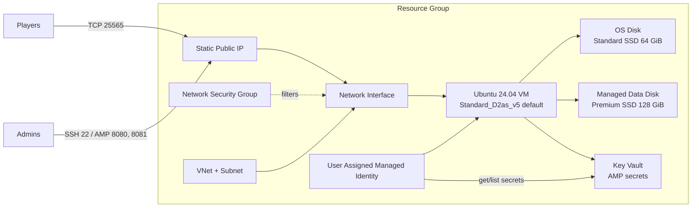

# Superior RPG Minecraft on Azure with AMP

Production-ready Terraform for a public Superior RPG Minecraft server managed by CubeCoders AMP on Microsoft Azure.

The design intentionally uses a single right-sized Linux VM and a dedicated managed data disk. That keeps monthly cost low, avoids unnecessary managed services, and preserves the performance characteristics Minecraft cares about most: strong single-core CPU, enough RAM for Forge/NeoForge, low-latency disk, and simple networking.

## Architecture



## Resource inventory

Created resources:

- Resource group
- Virtual network
- Subnet
- Network security group
- Static Standard public IP
- Network interface
- Ubuntu Server 24.04 LTS VM
- OS managed disk
- Dedicated managed data disk
- Boot diagnostics using Azure managed storage
- User-assigned managed identity
- Azure Key Vault with AMP bootstrap secrets

Not created by default:

- Azure Backup Recovery Services vault
- Storage account for boot diagnostics
- Load balancer
- NAT Gateway
- Bastion
- Application Gateway
- Private Endpoint
- Azure Monitor workspace

Those services are useful in larger environments, but they add fixed monthly cost or complexity that is not justified for one small public Minecraft server.

## VM sizing decision

Default: `Standard_D2as_v5`

Why this is the best initial performance-per-dollar choice:

- 2 vCPU and 8 GiB RAM match the initial target of one AMP panel plus one modded Superior RPG server for up to 8 concurrent players.
- AMD EPYC v5-series cores provide stable CPU without burst credits.
- 8 GiB RAM supports a 6 GiB Minecraft heap while leaving about 2 GiB for Ubuntu, AMP, filesystem cache, backups, and monitoring.
- D-series general-purpose memory density is better for Forge/NeoForge than F-series at the same RAM target.
- Premium SSD support allows a low-latency data disk without moving to a larger VM.

Comparison:

| Family | Example | Cost | Minecraft fit | Decision |
| --- | --- | --- | --- | --- |
| B-series | `Standard_B2ms` | Lowest compute price | Burstable CPU credits can be exhausted by a long-running modded server, causing TPS drops and chunk lag | Rejected for production stability |
| D-series | `Standard_D2as_v5` | Moderate | Stable CPU, 8 GiB RAM, good price/performance | Selected |
| F-series | `Standard_F4s_v2` | Higher than needed for this workload | Good CPU, but RAM-per-dollar is worse for Forge/NeoForge; smaller F sizes lack memory | Rejected for initial deployment |

Scale path without redesign:

- About 8 players: `Standard_D2as_v5`, `minecraft_memory_mb = 6144`
- About 20 players: resize to `Standard_D4as_v5`, set `minecraft_memory_mb = 10240` or `12288`, keep the same VNet, IP, NSG, Key Vault, and data disk

## Storage decision

Default data disk: `Premium_LRS`, 128 GiB.

Comparison:

| Disk type | Cost | Minecraft behavior | Decision |
| --- | --- | --- | --- |
| Standard HDD | Cheapest | High latency and poor random IO; chunk loading and backups can stall gameplay | Rejected |
| Standard SSD | Low | Acceptable for light vanilla servers, but latency is less predictable under modded chunk IO | Rejected for "excellent" performance target |
| Premium SSD | Moderate | Predictable low latency, simple, broadly available, supports host read caching | Selected |
| Premium SSD v2 | Tunable | Excellent performance, but more operational knobs and not necessary for 8-20 players | Rejected for cost/complexity |

The OS disk uses `StandardSSD_LRS` because OS IO is not the bottleneck. AMP and Minecraft state are placed on the Premium SSD data disk mounted at `/opt/minecraft`, with AMP data bind-mounted to `/home/amp/.ampdata`.

## Network and firewall rules

Azure NSG and UFW are configured with matching inbound rules.

| Port | Source | Purpose | Why open |
| --- | --- | --- | --- |
| TCP 22 | `admin_ssh_source_cidrs` | SSH administration | Required for Linux operations; restrict to admin IPs |
| TCP 8080 | `amp_panel_source_cidrs` | AMP ADS panel | Web management; restrict to admin IPs |
| TCP 8081 | `amp_panel_source_cidrs` | AMP Minecraft instance panel | Instance management; restrict to admin IPs |
| TCP 25565 | `minecraft_source_cidrs` | Minecraft Java gameplay | Public player access |
| TCP 80/443 | Disabled by default | Optional reverse proxy or TLS | Only open if `enable_http_https = true` |

RCON listens on `127.0.0.1:25575` only for local health checks and is not opened in Azure or UFW.

## Linux configuration

Cloud-init runs `/usr/local/sbin/bootstrap-amp-minecraft.sh` and automatically:

- Installs Java 21 and required packages
- Configures timezone and automatic security updates
- Disables SSH password authentication and root SSH login
- Configures UFW and fail2ban
- Applies kernel/network settings for lower latency
- Disables Transparent Huge Pages
- Sets high file and process limits for the `amp` user
- Formats and mounts the managed data disk
- Installs CubeCoders AMP unattended
- Creates the Minecraft AMP instance
- Downloads and installs the Superior RPG server pack
- Accepts the Minecraft EULA
- Configures server properties
- Enables local RCON for TPS health checks
- Installs systemd timers for backup and monitoring
- Starts AMP ADS and the Minecraft instance

Bootstrap logs are written to:

```bash
/var/log/amp-minecraft-bootstrap.log
```

## Minecraft optimization

Applied optimizations:

- Java 21: required by modern Minecraft and modded loaders.
- G1GC/Aikar-style JVM flags: reduces pause spikes and improves heap behavior for Minecraft.
- Fixed Xms/Xmx heap: avoids heap resizing stalls during gameplay.
- `AlwaysPreTouch`: faults heap pages during startup instead of during player activity.
- `MaxGCPauseMillis=200`: guides G1 toward predictable pauses.
- `view-distance=8`: balances chunk visibility with CPU and IO for 8 players.
- `simulation-distance=6`: reduces ticking load while preserving gameplay feel.
- `sync-chunk-writes=false`: improves chunk write throughput on modern server versions.
- `network-compression-threshold=256`: reduces bandwidth with moderate CPU cost.
- `use-native-transport=true`: uses Linux native networking when supported.
- `vm.swappiness=10`: avoids swap-induced TPS stalls.
- Transparent Huge Pages disabled: avoids Java latency spikes.
- Data disk `noatime`: removes unnecessary metadata writes.
- Minecraft process renice/ionice during health checks: favors game tick responsiveness over backup/utility work.

## Backups

Local compressed backups are created daily by systemd:

- Service: `minecraft-backup.service`
- Timer: `minecraft-backup.timer`
- Backup root: `/opt/minecraft/backups`
- Archive format: `tar.zst`
- Retention: `backup_retention_days` (default 14)

The archive includes `/home/amp/.ampdata`, which contains:

- AMP configuration
- Minecraft instance configuration
- World data
- Mods/plugins/config directories
- Logs and runtime metadata

Azure Backup is intentionally not enabled by default because the fixed vault/protected-instance cost is usually poor value for a low-cost hobby game server. If the world becomes high-value, add Azure Backup or external offsite backup as a second protection layer.

## Monitoring

Lightweight monitoring is installed with systemd:

- Service: `minecraft-health.service`
- Timer: `minecraft-health.timer`
- Interval: every 5 minutes
- Log: `/opt/minecraft/logs/health.log`

Collected signals:

- CPU usage
- RAM usage
- Disk usage
- AMP process IDs
- Minecraft Java process IDs
- TPS output via local RCON (`forge tps`, fallback `tps`)
- Recent TPS/MSPT/lag lines from latest.log if RCON is not ready

This avoids Azure Monitor workspace ingestion charges. For production alerting, forward these logs to your preferred monitoring system or add Azure Monitor later.

## Estimated monthly cost

Approximate pay-as-you-go monthly cost at 730 hours. Prices vary by region and date; verify with the Azure Pricing Calculator for your selected region.

| Component | Default | Estimate |
| --- | --- | --- |
| VM compute | `Standard_D2as_v5` Linux | about USD 70-90/month |
| OS disk | 64 GiB Standard SSD | about USD 3-5/month |
| Data disk | 128 GiB Premium SSD | about USD 18-22/month |
| Static public IP | Standard IPv4 | about USD 3-5/month |
| Key Vault | Standard, low transactions | usually under USD 1/month |
| Bandwidth | Low player count | usually minimal unless heavy downloads |

Expected default total: about USD 95-125/month.

Cost optimizations:

- Stop/deallocate the VM when not in use if the server is not always online.
- Use Azure savings plans or reservations for always-on hosting.
- Keep backups local and compressed unless offsite retention is required.
- Resize to `D4as_v5` only when player count or profiling justifies it.

## Deployment guide

Prerequisites:

- Terraform 1.8 or newer
- Azure CLI authenticated to the target subscription
- An AMP license key
- SSH public key
- HTTPS URL for the Superior RPG server pack zip

Steps:

```bash
cd terraform
cp terraform.tfvars.example terraform.tfvars
```

Edit `terraform.tfvars`:

- Set `ssh_public_key`
- Set `admin_ssh_source_cidrs` to your public IP/CIDR
- Set `amp_panel_source_cidrs` to your public IP/CIDR
- Set `amp_license_key`
- Set `superior_rpg_server_pack_url`
- Choose the Azure region closest to players

Deploy:

```bash
terraform init
terraform plan -out tfplan
terraform apply tfplan
```

After apply:

```bash
terraform output amp_panel_url
terraform output minecraft_server_address
terraform output ssh_command
```

Retrieve the generated AMP password if you did not set one:

```bash
az keyvault secret show \
  --vault-name "$(terraform output -raw key_vault_name)" \
  --name "$(terraform output -raw generated_amp_admin_password_secret_name)" \
  --query value \
  -o tsv
```

Watch first-boot bootstrap progress:

```bash
ssh azureadmin@$(terraform output -raw public_ip_address)
sudo tail -f /var/log/amp-minecraft-bootstrap.log
```

## Destroy guide

Destroy all resources:

```bash
cd terraform
terraform destroy
```

If you need to keep the world:

1. SSH to the VM.
2. Copy `/opt/minecraft/backups/*.tar.zst` or `/opt/minecraft/ampdata` to a safe location.
3. Run `terraform destroy`.

Key Vault soft delete is enabled for 7 days. The provider is configured not to purge soft-deleted vaults automatically.

## Troubleshooting

### Cloud-init or bootstrap failed

```bash
sudo tail -n 200 /var/log/amp-minecraft-bootstrap.log
sudo cloud-init status --long
```

Common causes:

- AMP license key invalid
- Superior RPG server pack URL is not reachable from Azure
- Key Vault access policy propagation delay
- AMP upstream repository temporarily unavailable

The bootstrap retries Key Vault reads, but AMP repository outages must be retried after the upstream service recovers.

### AMP panel does not load

Check:

```bash
sudo ufw status verbose
sudo -u amp ampinstmgr -l
sudo ss -lntp | grep -E '8080|8081'
```

Also verify `amp_panel_source_cidrs` includes your current public IP.

### Minecraft port is closed

Check:

```bash
sudo ufw status verbose
sudo ss -lntp | grep 25565
sudo -u amp ampinstmgr -s SuperiorRPG01
```

Also verify the Azure NSG allows TCP 25565 from `minecraft_source_cidrs`.

### Low TPS or lag spikes

Check:

```bash
tail -n 100 /opt/minecraft/logs/health.log
free -m
df -h /opt/minecraft
iostat -xz 1
```

Actions:

- Pregenerate world chunks.
- Reduce `view-distance` from 8 to 6.
- Reduce `simulation-distance` from 6 to 4.
- Increase VM size to `Standard_D4as_v5`.
- Increase `minecraft_memory_mb` after resizing.
- Review mod configuration for expensive worldgen or entities.

### Backups are not running

```bash
systemctl status minecraft-backup.timer
systemctl status minecraft-backup.service
tail -n 100 /opt/minecraft/logs/backup.log
```

Manual backup:

```bash
sudo systemctl start minecraft-backup.service
```

## Upgrade guide

### Resize for about 20 players

Edit `terraform.tfvars`:

```hcl
vm_size             = "Standard_D4as_v5"
minecraft_memory_mb = 10240
minecraft_max_players = 20
```

Apply:

```bash
terraform plan -out tfplan
terraform apply tfplan
```

Azure may reboot/redeploy the VM during resize. The static IP and data disk remain.

### Upgrade Superior RPG server pack

1. Upload the new server pack zip to a secure HTTPS location.
2. Update `superior_rpg_server_pack_url`.
3. SSH to the VM and remove the install marker:

```bash
sudo rm -f /var/lib/amp-superior-rpg-pack-installed.done
```

4. Re-run cloud-init script or manually apply pack maintenance during a maintenance window:

```bash
sudo /usr/local/sbin/bootstrap-amp-minecraft.sh
```

Take a backup first:

```bash
sudo systemctl start minecraft-backup.service
```

### Upgrade AMP

```bash
sudo -u amp ampinstmgr -p true true
```

Run this during a maintenance window.

## Security recommendations

- Replace default `0.0.0.0/0` admin CIDRs before deployment.
- Keep `enable_http_https = false` unless you configure a reverse proxy and TLS.
- Do not expose RCON publicly.
- Protect Terraform state because secret values are stored in state when Terraform creates Key Vault secrets.
- Store state in a secured remote backend for team use.
- Rotate the AMP admin password after first login if multiple administrators had access to Terraform state.
- Review `/var/log/amp-minecraft-bootstrap.log` permissions before sharing logs.
- Keep Ubuntu automatic security updates enabled.
- Keep the AMP panel restricted to trusted IPs or access it through an SSH tunnel/VPN.

## Performance tuning guide

Start with the defaults. Change only one variable at a time and observe TPS/MSPT.

Recommended progression:

1. Keep `D2as_v5`, heap 6144 MB, view distance 8, simulation distance 6.
2. Pregenerate chunks around spawn and common travel areas.
3. If RAM pressure occurs, reduce heap to 5632 MB or resize to D4as_v5.
4. If CPU is high and TPS drops, resize to D4as_v5 before increasing heap.
5. For 20 players, use D4as_v5 and 10-12 GiB heap.
6. Avoid oversized heaps; they can increase GC pauses without improving TPS.
7. Keep backups scheduled during low-player hours.

## File layout

```text
terraform/
  cloud-init/
    cloud-init.yaml.tftpl
  modules/
    compute/
      main.tf
      outputs.tf
      variables.tf
    network/
      main.tf
      outputs.tf
      variables.tf
    security/
      main.tf
      outputs.tf
      variables.tf
    storage/
      main.tf
      outputs.tf
      variables.tf
  scripts/
    bootstrap.sh.tftpl
  locals.tf
  main.tf
  outputs.tf
  providers.tf
  terraform.tfvars.example
  variables.tf
  versions.tf
```
